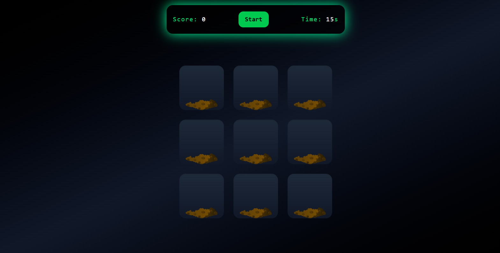
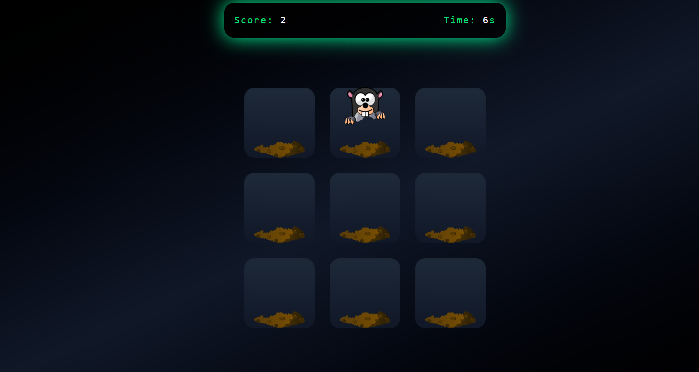

# Whack-A-Mole

A compact Whack-A-Mole web game built with React and Vite.

**Live Preview**
- Score the most hits before time runs out.
- Cute mole sprites and responsive controls.

**Screenshots**

Add the screenshots to `public/screenshots/` with these filenames so the images render:


START VIEW:



PLAYING VIEW:


## Features

- Simple 3x3 grid gameplay
- Score and countdown timer
- Click/tap mole to score
- Built with React and Vite

## Files of interest

- [src/App.jsx](src/App.jsx) — main app and layout
- [src/components/GameGrid.jsx](src/components/GameGrid.jsx) — grid and mole logic
- [index.html](index.html) — HTML entry

## Setup & Run

Prerequisites: Node.js (v16+ recommended) and npm.

Install dependencies:

```bash
npm install
```

Run the dev server:

```bash
npm run dev
```


## How to add the screenshots

1. Create the folder `public/screenshots/` if it doesn't exist.
2. Save the two attached images into that folder with the filenames above.
3. Reload the app or open `README.md` in a markdown viewer.

## Controls

- Click or tap on the mole when it appears to increase score.
- Press the Start button to begin a new round.

## License

This project is MIT-licensed — adapt as you like.

